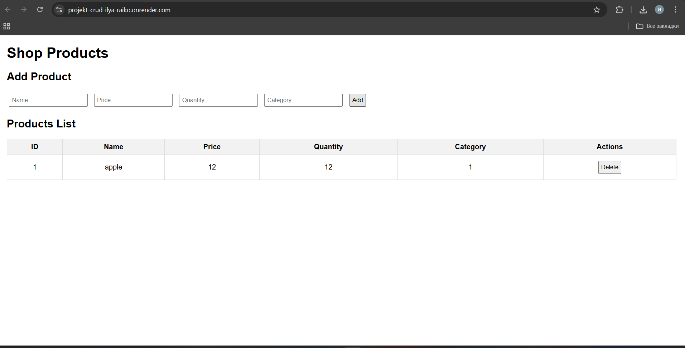

# Shop CRUD - Requirement A

## 1. Run locally

1. Go to backend:
   cd backend
2. Install dependencies:
   npm install
3. Start the server:
   node app.js
4. Open in browser:
   http://localhost:3000/
- The frontend allows full CRUD for products: adding, editing, deleting, and viewing the list.

## 2. API Endpoints

| Method | Endpoint        | Description                   |
|--------|----------------|-------------------------------|
| GET    | /products       | Get all products              |
| GET    | /products/:id   | Get a product by ID           |
| POST   | /products       | Add a new product             |
| PUT    | /products/:id   | Edit a product                |
| DELETE | /products/:id   | Delete a product              |

### Field validation:
- name (TEXT) - required  
- price (REAL) - required  
- quantity (INTEGER) - required  
- category (TEXT) - optional  

### HTTP codes:
- 200 OK - operation successful (GET, PUT, DELETE)  
- 201 Created - new product created (POST)  
- 400 Bad Request - missing required fields or invalid data type  
- 404 Not Found - product not found by ID

## 3. Entity: Product

| Field      | Type       | Description                     |
|----------- |----------- |-------------------------------- |
| id         | INTEGER    | Primary key, auto-increment     |
| name       | TEXT       | Product name                    |
| price      | REAL       | Product price                   |
| quantity   | INTEGER    | Product quantity                |
| category   | TEXT       | Product category (optional)     |

## 4. UI Screenshot

## 5. Git / Repository

- Each entity is in a separate module: backend/modules/products  
- Branch: feature/products-crud  
- Pull request to main should include implemented features, instructions to run locally, and the UI screenshot
